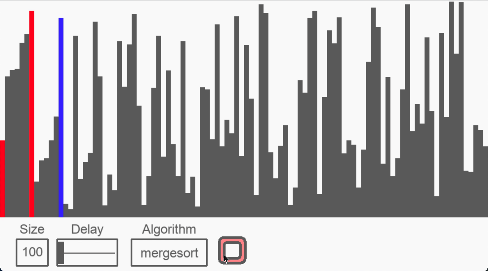
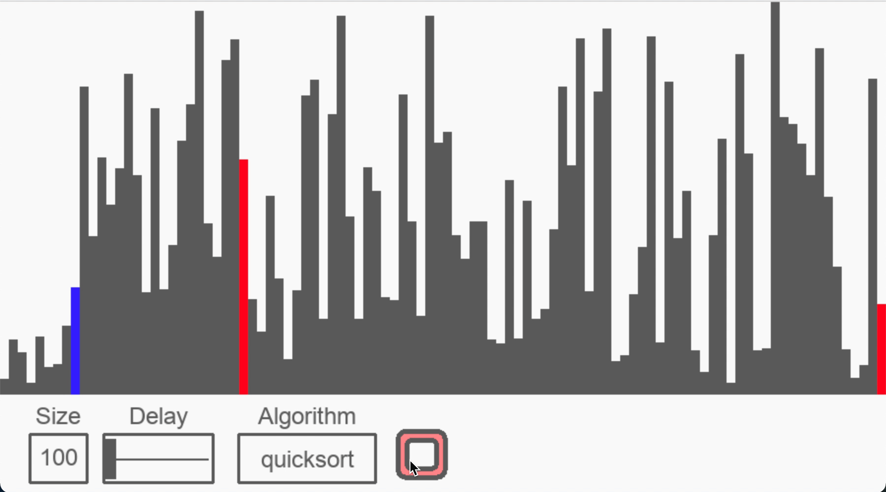
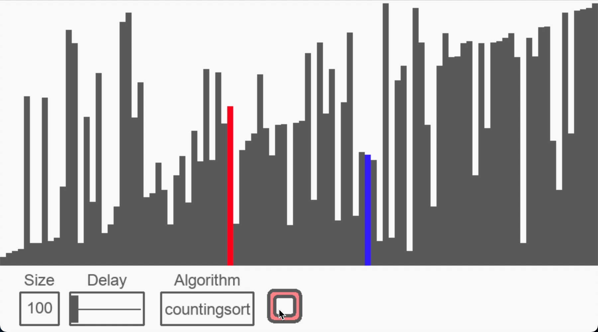
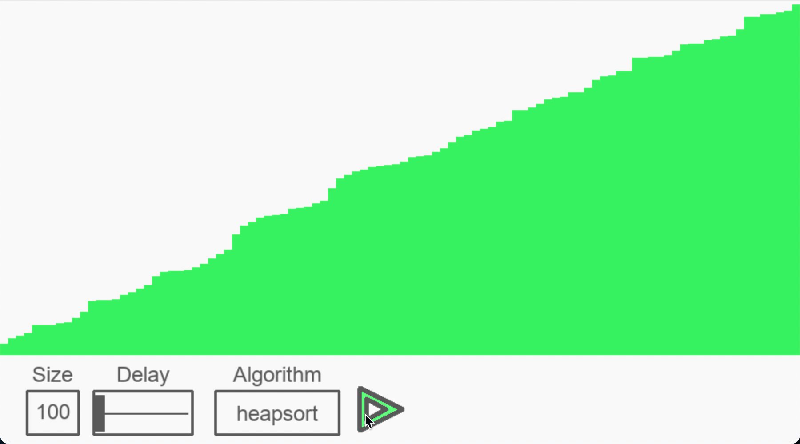
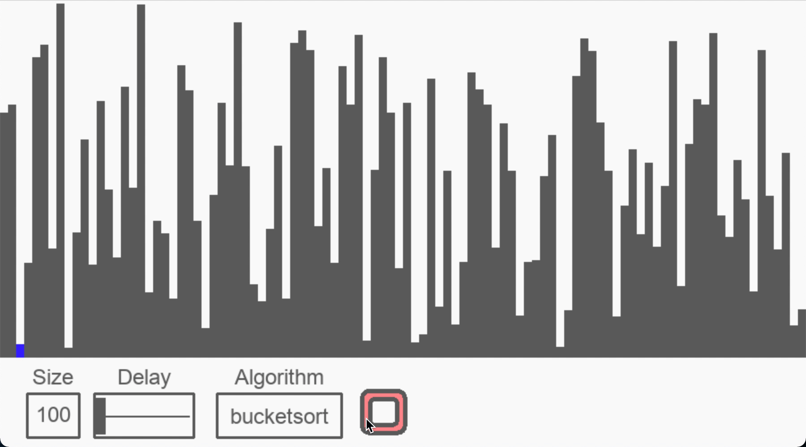

# Sorting Algorithms Visualizer

## Algorithms

### Bubble Sort  
Bubble sort is a comparison-based sorting algorithm in which each pair of adjacent elements is compared and the elements are swapped if they are not in order. 

Time complexity: 
|Best Case|Average Case|Worst Case|          
|:-:|:-:|:-:|
|O(n)|O(n2)|O(n2)|

 

  

### Selection Sort
Selection sort is an in-place comparison-based algorithm in which the list is divided into two parts, the sorted part at the left end and the unsorted part at the right end. Initially, the sorted part is empty and the unsorted part is the entire list.

Time complexity:
|Best Case|Average Case|Worst Case|          
|:-:|:-:|:-:|
|O(n2)|O(n2)|O(n2)|

  

### Insertion Sort
Insertion sort is an in-place comparison-based sorting algorithm. Here, a sub-list is maintained which is always sorted. For example, the lower part of an array is maintained to be sorted. An element which is to be 'insert'ed in this sorted sub-list, has to find its appropriate place and then it has to be inserted there. Hence the name, insertion sort. 

Time complexity:
|Best Case|Average Case|Worst Case|          
|:-:|:-:|:-:|
|O(n)|O(n2)|O(n2)|

  

### Cocktail Sort
Cocktail Sort is a variation of Bubble sort. The Bubble sort algorithm always traverses elements from left and moves the largest element to its correct position in first iteration and second largest in second iteration and so on. Cocktail Sort traverses through a given array in both directions alternatively.This algorithm is not suitable for large data sets where n is the number of items but is faster than bubble sort.

Time complexity:
|Best Case|Average Case|Worst Case|          
|:-:|:-:|:-:|
|O(1)|O(n2)|O(n2)|

  

### Merge Sort
Merge sort is a sorting technique based on divide and conquer technique. It is one of the most respected algorithms. Merge sort first divides the array into equal halves and then combines them in a sorted manner.

Time complexity:
|Best Case|Average Case|Worst Case|          
|:-:|:-:|:-:|
|O(nlogn)|O(nlogn)|O(nlogn)|

  

### Quick Sort
Quick sort is a highly efficient sorting algorithm and is based on partitioning of array of data into smaller arrays. A large array is partitioned into two arrays one of which holds values smaller than the specified value, say pivot, based on which the partition is made and another array holds values greater than the pivot value. Quicksort partitions an array and then calls itself recursively twice to sort the two resulting subarrays.

Time complexity:
|Best Case|Average Case|Worst Case|          
|:-:|:-:|:-:|
|O(nlogn)|O(nlogn)|O(n2)|

  

### Counting Sort
Counting sort is a sorting technique based on keys between a specific range. It works by counting the number of objects having distinct key values (kind of hashing). Then doing some arithmetic to calculate the position of each object in the output sequence. 

Time complexity:
|Best Case|Average Case|Worst Case|          
|:-:|:-:|:-:|
|O(n+k)|O(n+k)|O(n+k)|

  

### Heap Sort
Heap sort is a comparison based sorting technique based on Binary Heap data structure. It is similar to selection sort where we first find the maximum element and place the maximum element at the end. We repeat the same process for the remaining elements. 

Time complexity:
|Best Case|Average Case|Worst Case|          
|:-:|:-:|:-:|
|O(nlogn)|O(nlogn)|O(nlogn)|

A Binary Heap is a Complete Binary Tree where items are stored in a special order such that value in a parent node is greater(or smaller) than the values in its two children nodes. The former is called as max heap and the latter is called min-heap. The heap can be represented by a binary tree or array.

  

### Bucket Sort
Bucket sort is mainly useful when input is uniformly distributed over a range. It works by distributing the elements of an array into a number of buckets. Each bucket is then sorted individually, either using a different sorting algorithm, or by recursively applying the bucket sorting algorithm. 

Time complexity:
|Best Case|Average Case|Worst Case|          
|:-:|:-:|:-:|
|O(n+k)|O(n+k)|O(n2)|

